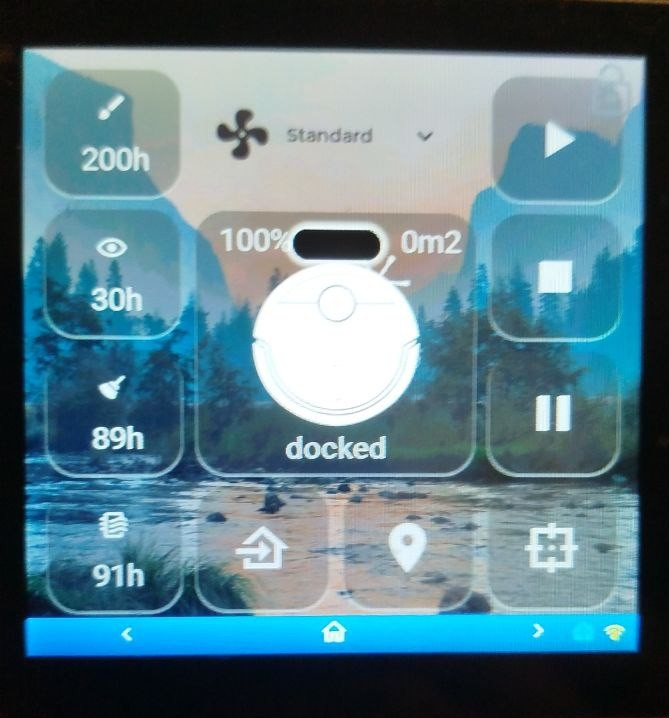
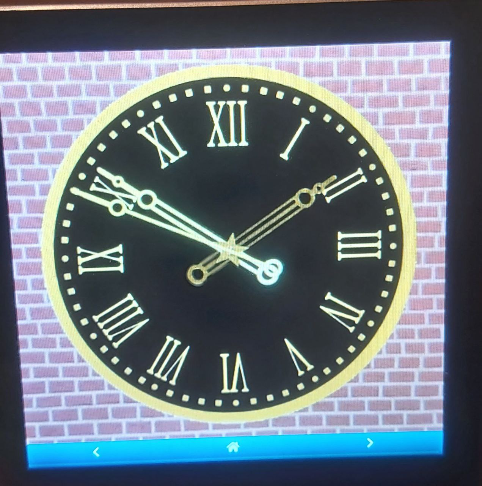
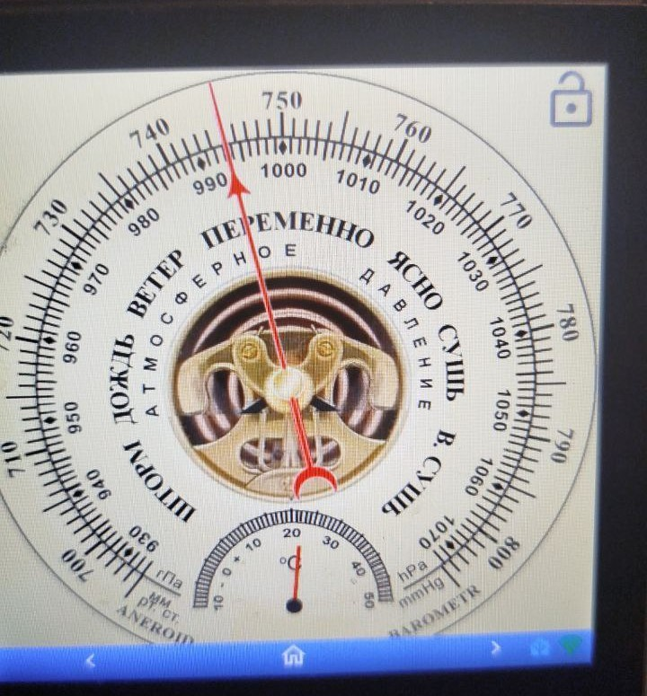

# Esphome-ESP32-S3-4848S040-LVGL  quickly create your own pages

https://aliexpress.ru/item/1005008214872438.html

[![License][license-shield]][license]
[![ESPHome release][esphome-release-shield]][esphome-release]

[license-shield]: https://img.shields.io/static/v1?label=License&message=MIT&color=orange&logo=license
[license]: https://opensource.org/licenses/MIT
[esphome-release-shield]: https://img.shields.io/static/v1?label=ESPHome&message=2025.10.4&color=green&logo=esphome
[esphome-release]: https://GitHub.com/esphome/esphome/releases/


     
# Базовый конфиг 

holl-informer.yaml 

создаем папку packages в esphome, копируем нужные пакеты в папку , указываем первоначальную страницу, фон для страниц 

# Добавляем пакеты (страницы)
``` yaml
packages:
``` 
# Обязательные пакеты    
``` yaml
   wifi: !include packages/display/wifi.yaml
   disp:  !include packages/display/display.yaml
```    
# основная страница
``` yaml
  weather: !include 
    file: packages/display/weather_anime_gif.yaml # выбрать один weather (gif можно использовать любые другие)
    #file: packages/display/weather_mdi_color.yaml #
    #file: packages/display/weather_icons.yaml # в файле есть выбор 4 типов иконок (можно использовать любые другие)
    #file: packages/display/weather_anime.yaml # выбрать один weather
    vars:
      background_weather: back6
      sensor_weather: weather.iaroslavskaia
```
  указываем свои сущности для каждого пакета (смотри примеры holl-informer.yaml)
      
# выбираем количество кнопок
``` yaml
  dis_butt_x: !include 
    file: packages/display/dis_butt_x.yaml 
``` 
указываем иконки и id страниц  (смотри примеры holl-informer.yaml)

# добавляем необходимые сенсоры на основной экран + дополнительная страница сенсора
``` yaml
  xxxx: !include 
    file:packages/display/dishwasher.yaml или washing.yaml
    file: packages/display/barometr_page.yaml или file: packages/display/barometr.yaml 
    file: packages/display/thermometer.yaml
    file: packages/display/humm-out.yaml
    file: packages/display/geomag.yaml
    file: packages/display/UV.yaml
    file: packages/display/wind.yaml 
    file: packages/display/iaq.yaml
    file: packages/display/co2.yaml
    file: packages/display/voc.yaml
    file: packages/display/birch.yaml
    file: packages/display/grass.yaml
    file: packages/display/ragweed.yaml
    file: packages/display/humm.yaml
    file: packages/display/thermostat.yaml или file: packages/display/boiler.yaml
    file: packages/display/clock_page.yaml (указываем необходимость отображения даты)
    
    file: packages/display/door_bell.yaml (требует много ресурсов, при большом количестве страниц может не запустится)
    Этот компонент требует достаточного объема оперативной памяти как для загрузки изображения, так и для хранения декодированного изображения.

    
    vars:
      указываем свои сущности для каждого пакета (смотри примеры holl-informer.yaml)
``` 
Раставляем страницы в желаемой последовательности
на главную страницу сенсоры добавляются автоматически при добавлении пакета

# Добавляем прочие страницы
``` yaml
  xxxx: !include 
    file: packages/display/button-x.yaml
    file: packages/display/shutter-x.yaml
    file: packages/display/slider-4x.yaml

    vars:
      указываем свои сущности для каждого пакета ("light.toggle" "switch.toggle" "button.press), типы действия (смотри примеры holl-informer.yaml)
```  
# Страница пульта ТВ LG
``` yaml
  lg: !include 
    file: packages/display/lg_light.yaml 
    vars:
      указываем свои коды (при необходимости поменять в скрипте тип команд) (смотри примеры holl-informer.yaml)
``` 
# Основной слой, стиль, блокировка экрана 
``` yaml
    top:  !include packages/display/top_stl_blk.yaml  без блокировки top:  !include packages/display/top_stl.yam
``` 
# Страничка настроек 
``` yaml
    settings: !include packages/display/settings.yaml 
``` 
разворот экрана пока не работает

# Веб морда при необходимости
``` yaml
    web: !include included/web.yaml
```
# font

[MaterialDesign-Webfont](https://github.com/Templarian/MaterialDesign-Webfont/tree/master/fonts)

[DSEG](https://github.com/keshikan/DSEG/tree/master/src)

[icons](https://github.com/alaltitov/Guition-ESP32-S3-4848S040/blob/dev/src/assets/fonts)

# TODO 

BME680, rotation display, weather page, graph page


# примеры смотри [holl-informer.yaml](./holl-informer.yaml) и [kitchen-informer.yaml](./kitchen-informer.yaml)


|                                               |                                                 |                                                   |                                                 | 
|-----------------------------------------------|-------------------------------------------------|---------------------------------------------------|-------------------------------------------------|
|  |  |
|  |  |  |  | 
|  |  |  |  |
| |  | |  | 
|  |  |  |  | 
|  |  |  |  |
|  |  |   |  | 
|  |  |  |  | 
|  


https://aliexpress.ru/item/1005006335587633.html

https://github.com/Limych/ha-gismeteo

https://community.home-assistant.io/t/guition-4-480x480-esp32-s3-4848s040-smart-display-with-lvgl/729271

https://github.com/albert-canfield/HA-panel-esphome

https://github.com/GlennGoddard/CanvasGaugeBackgrounds

