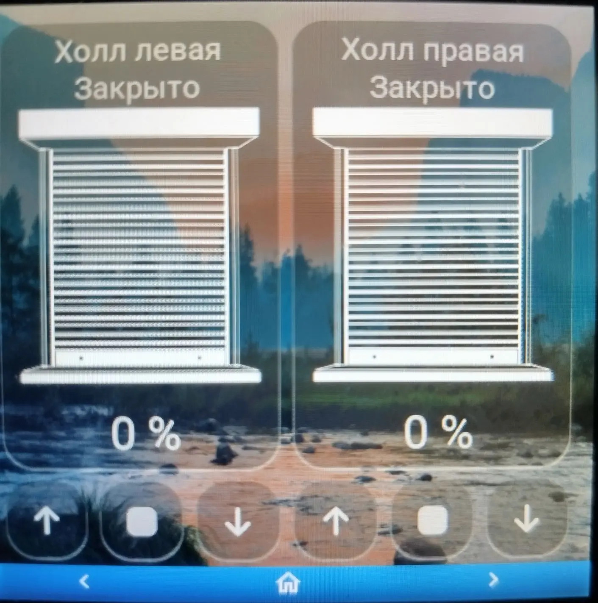

# Esphome-ESP32-S3-4848S040-LVGL  quickly create your own pages

https://aliexpress.ru/item/1005008214872438.html

[![License][license-shield]][license]
[![ESPHome release][esphome-release-shield]][esphome-release]

[license-shield]: https://img.shields.io/static/v1?label=License&message=MIT&color=orange&logo=license
[license]: https://opensource.org/licenses/MIT
[esphome-release-shield]: https://img.shields.io/static/v1?label=ESPHome&message=2025.10.4&color=green&logo=esphome
[esphome-release]: https://GitHub.com/esphome/esphome/releases/

# Базовы конфиг holl-informer.yaml 

создаем папку packages в esphome, копируем нужные пакеты в папку
основная страница
   weather_anime.yaml или weather.yaml

# выбираем количество кнопок

    file: packages/display/dis_butt_x.yaml 
указываем иконки и ид страниц

# добавляем необходимые сенсоры на основной экран + дополнительная страница сенсора

    file:packages/display/dishwasher.yaml или washing.yaml
    file: packages/display/barometr_page.yaml или file: packages/display/barometr.yaml 
    file: packages/display/thermometer.yaml
    file: packages/display/humm-out.yaml
    file: packages/display/geomag.yaml
    file: packages/display/UV.yaml
    file: packages/display/wind.yaml 
    file: packages/display/iaq.yaml
    file: packages/display/co2.yaml
    file: packages/display/voc.yaml
    file: packages/display/birch.yaml
    file: packages/display/grass.yaml
    file: packages/display/ragweed.yaml
    file: packages/display/humm.yaml
    file: packages/display/thermostat.yaml или file: packages/display/boiler.yaml
    file: packages/display/clock_page.yaml (указываем необходимость отображения даты)
    
Раставиляем страницы в желаемой очередности 
на главную страеицу сенсоры добавляются автоматически при добавлении пакета

# Добавляем прочие страницы

    file: packages/display/button-x.yaml
    file: packages/display/shutter-x.yaml
    file: packages/display/slider-4x.yaml
указываем свои сущьности, типы действия, первоначальную страницу, фон для страниц 
выбор сущности "light.toggle" "switch.toggle" "button.press"

# Страница пульта ТВ

    file: packages/display/lg_light.yaml 

# Основной слой, стиль блокировка экрана 

    top:  !include packages/display/top_stl_blk.yaml  без блокировки top:  !include packages/display/top_stl.yam

# Обязательные пакеты    
     wifi: !include packages/display/wifi.yaml
     disp:  !include packages/display/display.yaml

# Страничка настроек (разворот экрана пока не работает)

    settings: !include packages/display/settings.yaml 

# Веб морда при необходимости
    web: !include included/web.yaml

# примеры смотри holl-informer.yaml и packages.yaml

|                                               |                                                 |                                                   |                                                 | 
|-----------------------------------------------|-------------------------------------------------|---------------------------------------------------|-------------------------------------------------|
|   |  |  |  |
|   |  |   |  | 
|  |  |  |  | 
|   |  |  |  | 
|   |  |  |  | 
|   |  |  |  | 
|   |  | |  |

https://aliexpress.ru/item/1005006335587633.html

https://github.com/Limych/ha-gismeteo

https://community.home-assistant.io/t/guition-4-480x480-esp32-s3-4848s040-smart-display-with-lvgl/729271

https://github.com/albert-canfield/HA-panel-esphome

https://github.com/GlennGoddard/CanvasGaugeBackgrounds

# Weather_anime позаимствован от сюда, картинки и шрифт icons там же
https://github.com/alaltitov/display
